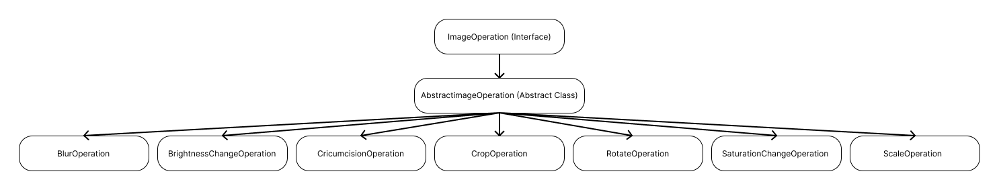

У проекті реалізовані ключові концепції ООП, такі як наслідування, поліморфізм та ієрархія класів. Ось як це реалізовано:

### Наслідування
Я створила абстрактний базовий клас AbstractImageOperation, який імплементує інтерфейс ImageOperation. Цей клас визначає спільну структуру та поведінку для всіх операцій з зображенням, зокрема він містить абстрактний метод doOperation, який має бути реалізований у похідних класах.
Класи операцій, такі як BlurOperation, BrightnessChangeOperation, RotateOperation тощо, наслідуються від AbstractImageOperation та реалізують метод doOperation, надаючи специфічну для кожної операції логіку обробки зображень.
### Поліморфізм
Поліморфізм реалізований через використання інтерфейсу ImageOperation та абстрактного класу AbstractImageOperation. Це дозволяє викликати метод apply на об'єктах різних класів, які наслідуються від AbstractImageOperation, через єдиний інтерфейс. В Main класі це використовується для застосування різних трансформацій до зображення.
### Ієрархія класів
Ієрархія класів вибудована навколо абстрактного класу AbstractImageOperation, який визначає основу для всіх операцій з обробки зображень. Конкретні операції є розширеннями цього класу, що демонструє використання наслідування для створення більш специфічних функцій.
### Ключові класи/методи
AbstractImageOperation — базовий клас для всіх операцій з зображенням. Він визначає шаблонний метод apply, який виконує загальну логіку (наприклад, логування) та викликає doOperation для конкретної реалізації.
BlurOperation, BrightnessChangeOperation, RotateOperation і т.д. — класи, що реалізують специфічні операції обробки зображень. Вони наслідуються від AbstractImageOperation і реалізують метод doOperation.

### Діаграма ієрархії коду

Ця структура ілюструє як `AbstractImageOperation` служить як базовий клас для всіх конкретних операцій з зображенням, що дозволяє реалізувати поліморфізм та наслідування в рамках бібліотеки обробки зображень.

### Структура бібліотеки класів

Бібліотека класів структурована таким чином, що дозволяє легко розширювати функціональність обробки зображень, додаючи нові класи операцій, які наслідуються від `AbstractImageOperation`. Це дозволяє зберігати код організованим і підтримуваним, а також забезпечує єдиний інтерфейс через метод `apply` для застосування операцій до зображень.
### Висновок
Проект  ефективно використовує концепції ООП, зокрема наслідування та поліморфізм, для створення гнучкої та розширюваної системи обробки зображень. Використання абстрактного класу `AbstractImageOperation` як основи для всіх операцій з зображенням забезпечує чудову основу для подальшого розвитку проекту. Я можу додавати нові операції, просто розширюючи цей клас та реалізовуючи метод `doOperation` для конкретної логіки операції.
Ця структура також підтримує високий рівень інкапсуляції та забезпечує чітке відділення відповідальності між класами, що робить код вашого проекту легким для розуміння, тестування та підтримки.

